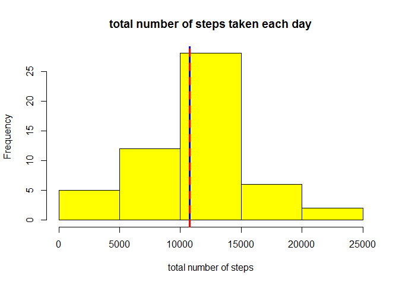
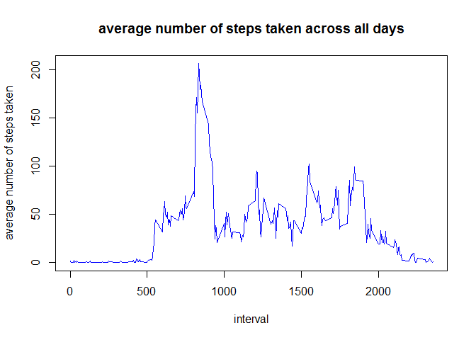
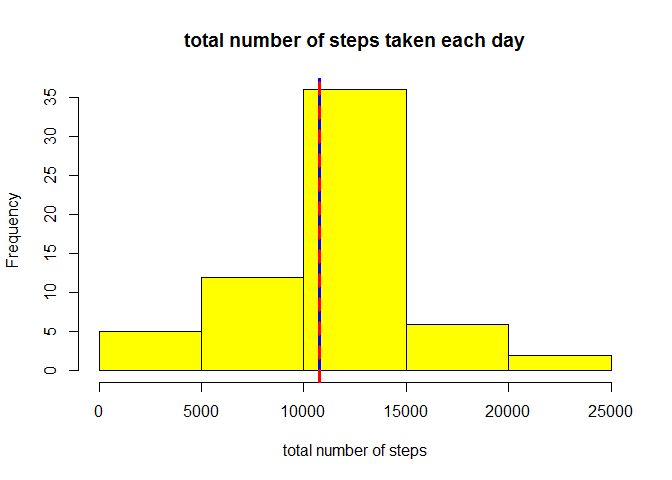
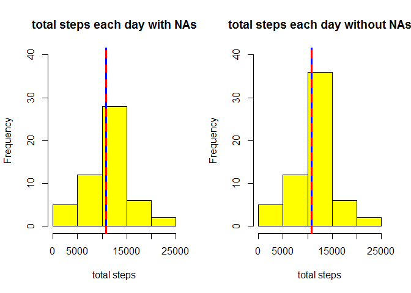
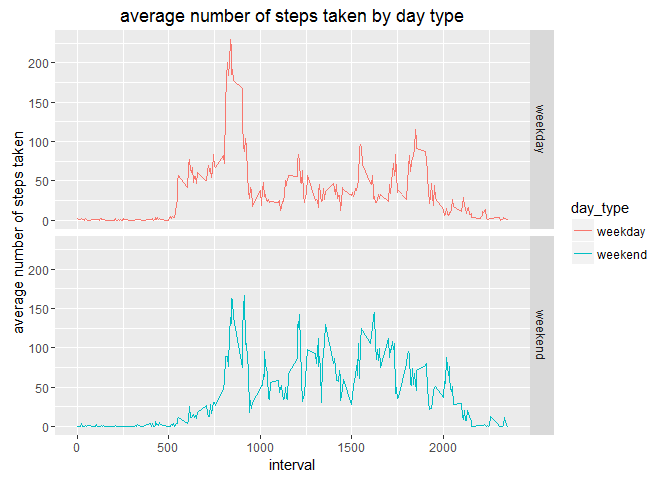

# Reproducible Research: Peer Assessment 1
Giannis S. Skoulikis  
March 27, 2016  

### Loading the necessary libraries


```r
library(plyr)
library(ggplot2)
```


## Loading and preprocessing the data

The data are given from the [course web site][1]. So, we simply download the zip. file and store it in the ***data*** variable. 


```r
setwd("C:\\Users\\Giannis\\Desktop\\RepData_PeerAssessment1")

if(!file.exists("activity.csv")){
    fileUrl <- "https://d396qusza40orc.cloudfront.net/repdata%2Fdata%2Factivity.zip"
    download.file(fileUrl,destfile="activity.zip")
    unzip("activity.zip")
}
data <- read.csv("activity.csv")
```

[1]: https://d396qusza40orc.cloudfront.net/repdata%2Fdata%2Factivity.zip "**course web site**"

## What is mean total number of steps taken per day?

At first, we display the structure of the ***data*** variable. 


```r
str(data)
```

```
## 'data.frame':	17568 obs. of  3 variables:
##  $ steps   : int  NA NA NA NA NA NA NA NA NA NA ...
##  $ date    : Factor w/ 61 levels "2012-10-01","2012-10-02",..: 1 1 1 1 1 1 1 1 1 1 ...
##  $ interval: int  0 5 10 15 20 25 30 35 40 45 ...
```

For this part of the assignment, we ignore the missing values in the dataset. So, we calculate the total number of steps taken per day.


```r
steps_day <- aggregate(steps ~ date, data, sum)
```

A histogram of the sums is shown below along with the mean and median values. 


```r
hist(steps_day$steps, col = "yellow", main = "total number of steps taken each day", xlab = "total number of steps")
abline( v = mean(steps_day$steps), lwd = 3, col = "blue") 
abline( v = median(steps_day$steps), lwd = 3, lty = 8, col = "red") 
```



We verify the graphical values of the mean and median, using the ***sumamrise*** function. 


```r
summary(steps_day$steps)
```

```
##    Min. 1st Qu.  Median    Mean 3rd Qu.    Max. 
##      41    8841   10760   10770   13290   21190
```

## What is the average daily activity pattern?

We calculate the average number of steps taken, using again the ***aggregate*** command and then we create a histogram of the average steps taken acroos all days. 


```r
steps_inter <- aggregate(steps ~ interval, data, mean)

plot(steps_inter$interval, steps_inter$steps, type = "l", main = "average number of steps taken across all days", xlab = "interval", ylab = "average number of steps taken", col = "blue")
```



The 5-minute interval that contains the maximum number of steps on average across all the days in the dataset is listed below. 


```r
max_steps <- which.max(steps_inter$steps)
steps_inter[max_steps,]
```

```
##     interval    steps
## 104      835 206.1698
```

## Imputing missing values

We find and calculate the total number of NAs in the ***steps*** column of the ***data*** variable.


```r
find_NAs <- is.na(data$steps)
length(find_NAs)
```

```
## [1] 17568
```

We choose to replace the NAs with the mean for that 5-minute interval. After that, we create a new dataset that is equal to the original dataset but with the missing data filled in.


```r
new_data <- merge(data, steps_inter, by = "interval")
find_NAs <- is.na(new_data$steps.x)
new_data$steps.x[find_NAs] <- new_data$steps.y[find_NAs]
new_data <- new_data[, 1:3]
final <- new_data[order(new_data$date, new_data$interval),]
```

We calculate the total number of steps taken per day and present a histogram of the new sums is shown below along with the mean and median values.


```r
new_steps_day <- aggregate(steps.x ~ date, final, sum)
names(new_steps_day) <- names(steps_day)

hist(new_steps_day$steps, col = "yellow", main = "total number of steps taken each day", xlab = "total number of steps")
abline( v = mean(new_steps_day$steps), lwd = 3, col = "blue") 
abline( v = median(new_steps_day$steps), lwd = 3, lty = 8, col = "red") 
```



The comparison of the plot above with the plot from the first part of the simulation is shown below. 


```r
par(mfrow = c(1,2))
hist(steps_day$steps, col = "yellow", main = "total steps each day with NAs", xlab = "total steps", ylim = c(0, 40) )
abline( v = mean(steps_day$steps), lwd = 3, col = "blue") 
abline( v = median(steps_day$steps), lwd = 3, lty = 8, col = "red")

hist(new_steps_day$steps, col = "yellow", main = "total steps each day without NAs", xlab = "total steps", ylim = c(0, 40))
abline( v = mean(new_steps_day$steps), lwd = 3, col = "blue") 
abline( v = median(new_steps_day$steps), lwd = 3, lty = 8, col = "red") 
```



As we can see, the mean and median values seem not to have changed.

We verify the graphical values of the mean and median, using the ***sumamrise*** function and comparing with the first ones.  


```r
summary(new_steps_day)
```

```
##          date        steps      
##  2012-10-01: 1   Min.   :   41  
##  2012-10-02: 1   1st Qu.: 9819  
##  2012-10-03: 1   Median :10766  
##  2012-10-04: 1   Mean   :10766  
##  2012-10-05: 1   3rd Qu.:12811  
##  2012-10-06: 1   Max.   :21194  
##  (Other)   :55
```

```r
summary(steps_day)
```

```
##          date        steps      
##  2012-10-02: 1   Min.   :   41  
##  2012-10-03: 1   1st Qu.: 8841  
##  2012-10-04: 1   Median :10765  
##  2012-10-05: 1   Mean   :10766  
##  2012-10-06: 1   3rd Qu.:13294  
##  2012-10-07: 1   Max.   :21194  
##  (Other)   :47
```

## Are there differences in activity patterns between weekdays and weekends?

At first, we replace the days in the previous dataset with the day that it represents. 
Then, we create a new factor variable in the dataset with two levels – “weekday” and “weekend” indicating whether a given date is a weekday or weekend day, using the ***weekdays*** function.


```r
Sys.setlocale("LC_TIME", "English") 
```

```
## [1] "English_United States.1252"
```

```r
final$date <- weekdays(as.Date(final$date))

final$date <- mapvalues(final$date, c("Monday", "Tuesday", "Wednesday", "Thursday", "Friday",  "Saturday",  "Sunday"), c("weekday", "weekday", "weekday", "weekday", "weekday", "weekend", "weekend"))

steps_week <- aggregate(steps.x ~ interval + date, final, mean)
names(steps_week) <- c("interval", "day_type", "steps")
```

Finally, we create a panel plot containing a time series plot of the 5-minute interval (x-axis) and the average number of steps taken, averaged across all weekday days or weekend days (y-axis).


```r
g <- qplot(interval, steps, data = steps_week, colour = day_type, geom = "line", main = "average number of steps taken by day type", xlab = "interval", ylab = "average number of steps taken") 
g + geom_line() + facet_grid(day_type  ~ ., scales="fixed") 
```


